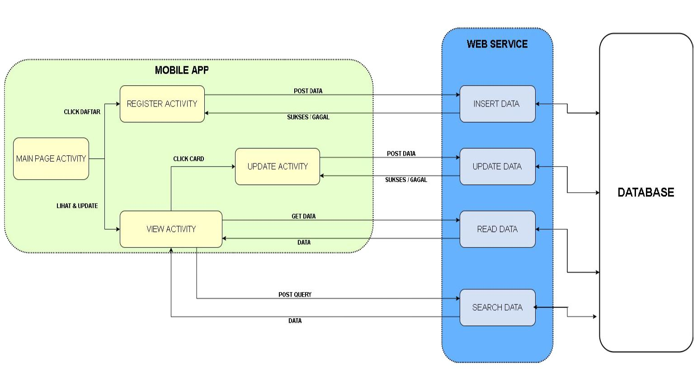

# Alumni Mobile App

Android mobile app for updating alumni database (ET4107 Final Project)

## Description

Android app for managing alumni data in the database. The mobile app will make a request to the web service, then the web service will process the request.

## Design

### System

Features:
* Insert new alumni data
* Update existing alumni data
* Search alumni data based on name and year

### User Interface

